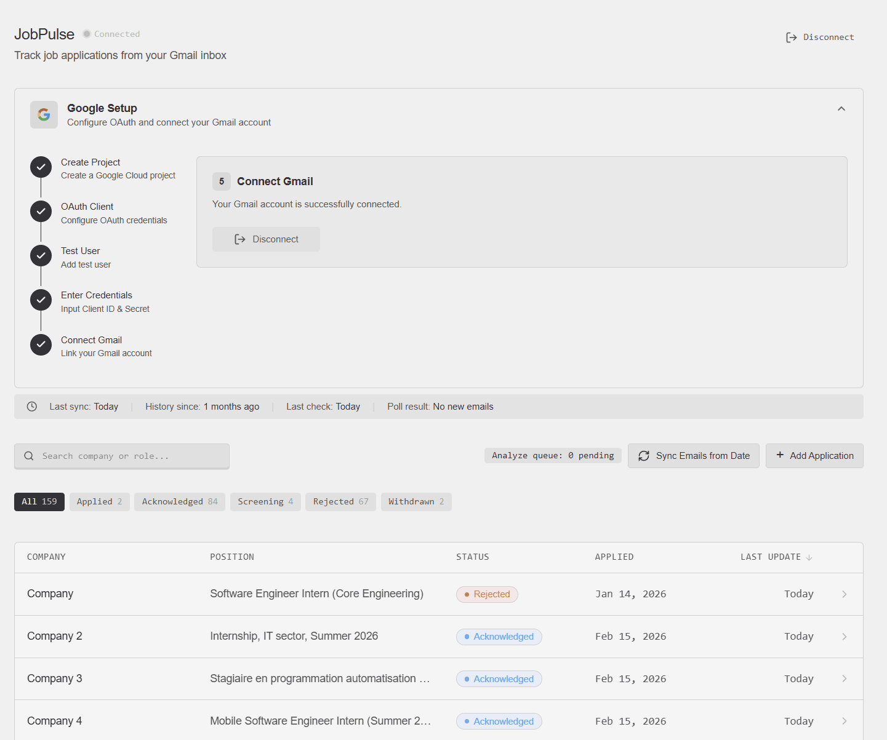

# TrackApply - Job Application Tracker

An intelligent job application tracking system that automatically scans your Gmail, classifies recruitment emails using AI, and helps you keep track of your job applications throughout the entire hiring process.



## ✨ Features

### 🤖 Automated Email Processing
- **Gmail Integration**: Connect your Gmail account via OAuth2
- **Automatic Scanning**: Built-in cron job scans your inbox every 5 minutes
- **Smart Classification**: Uses Google Gemini Flash Lite to classify emails into:
  - `RECRUITMENT_ACK` - Application acknowledgment
  - `NEXT_STEP` - Interview invites, assessments, next stages
  - `DISAPPROVAL` - Rejections, position filled

### 📊 Application Tracking
- **Timeline View**: See all interactions with each company in chronological order
- **Status Management**: Track applications through stages: Applied → Acknowledged → Screening → Rejected/Hired
- **Company & Position Extraction**: Automatically extracts job details from emails
- **Manual Applications**: Add applications manually that weren't sent via email

### 🏷️ Gmail Organization
- **Auto-Labeling**: Automatically applies labels to your Gmail threads based on classification
- **Label Creation**: Creates labels automatically if they don't exist
- **Confidence Indicators**: Low-confidence emails get a special label for review

### 🔄 Background Processing
- **Job Queue**: Uses PG-Boss for reliable background job processing
- **Retry Logic**: Failed jobs are automatically retried with exponential backoff

### 🎨 Modern Web Interface
- **Dashboard**: Overview of all your applications with status filters
- **Application Detail View**: Complete history of all emails and events for each application
- **Merge Applications**: Merge duplicate applications for the same position
- **Manual Sync**: Trigger manual email sync from a specific date
- **Real-time Status**: See sync progress and queue statistics

## 🏗️ Architecture

### Tech Stack

**Frontend:**
- React 19 + TypeScript
- TanStack Router (type-safe routing)
- TanStack Query (data fetching)
- Tailwind CSS + shadcn/ui components
- tRPC client (type-safe API calls)
- Vite (build tool)

**Backend:**
- Hono (fast, lightweight web framework)
- tRPC (type-safe API)
- Better Auth (authentication)
- PG-Boss (PostgreSQL-based job queue)
- Google APIs (Gmail + Gemini)

**Database:**
- PostgreSQL
- Drizzle ORM (type-safe queries)

**AI:**
- Google Gemini Flash Lite (email classification)

### Project Structure

```
.
├── apps/
│   ├── web/                    # Frontend React app
│   │   ├── src/
│   │   │   ├── components/     # UI components
│   │   │   │   ├── applications/   # Application-related components
│   │   │   │   ├── dashboard/      # Dashboard components
│   │   │   │   └── ui/             # shadcn/ui components
│   │   │   ├── routes/         # TanStack Router routes
│   │   │   ├── hooks/          # Custom React hooks
│   │   │   └── lib/            # Utilities & tRPC client
│   │   └── package.json
│   │
│   └── server/                 # Backend API server
│       ├── src/
│       │   ├── db/             # Database schemas & migrations
│       │   ├── jobs/           # Background job handlers
│       │   │   ├── handlers/   # Job implementations
│       │   │   │   ├── process-email.ts    # Fetch email from Gmail
│       │   │   │   ├── analyze-content.ts  # Classify with Gemini
│       │   │   │   └── label-email.ts      # Apply Gmail labels
│       │   │   ├── pgboss.ts   # Job queue setup
│       │   │   └── schedule.ts # Cron jobs
│       │   ├── routers/        # tRPC routers
│       │   ├── services/       # Business logic
│       │   │   ├── gmail-service.ts        # Gmail API client
│       │   │   ├── email-classifier.ts     # Gemini classification
│       │   │   └── job-tracking-service.ts # Application tracking logic
│       │   └── index.ts        # Server entry point
│       └── package.json
│
├── turbo.json                  # Turborepo configuration
└── package.json                # Root package.json
```

### Data Flow

```
Gmail API
    │
    └──► Cron Job (every 5 min) ──► List new messages
                                           │
                                           ▼
                              ┌─────────────────────┐
                              │   PG-Boss Queue     │
                              │                     │
                              │  1. process-email   │──► Fetch email from Gmail
                              │  2. analyze-content │──► Classify with Gemini
                              │  3. label-email     │──► Apply Gmail labels
                              └─────────────────────┘
                                         │
                                         ▼
                              ┌─────────────────────┐
                              │   PostgreSQL DB     │
                              │                     │
                              │  job_applications   │
                              │  application_events │
                              │  application_notes  │
                              └─────────────────────┘
```

## 🚀 Getting Started

### Prerequisites

- Node.js 18+
- PostgreSQL database (or Docker)
- Google Cloud project with Gmail API enabled
- Gemini API key

### 1. Clone & Install

```bash
# Clone the repository
git clone https://github.com/Soif2Sang/TrackApply
cd TrackApply

# Install dependencies
npm install
```

### 2. Environment Setup

Copy `.env.example` to `.env` in the root directory and fill in your values:

```bash
cp .env.example .env
```

### 3. Database Setup

```bash
# Start PostgreSQL (using Docker)
cd apps/server
npm run db:start

# Push database schema
npm run db:push
```

### 4. Google Cloud Setup

1. Go to [Google Cloud Console](https://console.cloud.google.com/)
2. Create a new project or select existing
3. Enable the **Gmail API**
4. Create OAuth 2.0 credentials (Web application type)
5. Add authorized redirect URI: `http://localhost:3002/auth/gmail/callback`
6. Copy Client ID and Client Secret to your `.env`

### 5. Start Development

```bash
# From root directory
npm run dev
```

The app will be available at:
- Frontend: http://localhost:3003
- Backend: http://localhost:3002

### 6. Connect Gmail

1. Sign up / Sign in to the application
2. Go to settings and configure your Gmail OAuth credentials
3. Click "Connect Gmail" and authorize the application
4. The system will start scanning your emails every 5 minutes

## 📝 Available Scripts

```bash
# Development (from root)
npm run dev              # Start all apps in development mode
npm run dev:web          # Start frontend only
npm run dev:server       # Start backend only

# Build
npm run build            # Build all apps

# Database (from apps/server)
npm run db:push          # Push schema changes to database
npm run db:generate      # Generate migrations
npm run db:migrate       # Run migrations
npm run db:studio        # Open Drizzle Studio
npm run db:start         # Start PostgreSQL in Docker
npm run db:stop          # Stop PostgreSQL
```

## 🔧 Configuration

### Email Processing

| Variable | Description | Default |
|----------|-------------|---------|
| `EMAIL_SYNC_BATCH_SIZE` | Emails to process per batch | 50 |
| `EMAIL_SYNC_PAGE_SIZE` | Page size for Gmail API queries | 100 |
| `EMAIL_SYNC_MAX_TOTAL` | Max emails per sync (0 = unlimited) | 0 |
| `EMAIL_SYNC_MAX_AGE_DAYS` | How far back to sync emails | 90 |

### Job Queue

| Variable | Description | Default |
|----------|-------------|---------|
| `PROCESS_EMAIL_CONCURRENCY` | Parallel email fetching | 2 |
| `ANALYZE_CONTENT_CONCURRENCY` | Parallel AI classification | 2 |
| `LABEL_EMAIL_CONCURRENCY` | Parallel label operations | 4 |
| `ANALYZE_RETRY_LIMIT` | Max retries for AI calls | 5 |
| `ANALYZE_RETRY_DELAY_SECONDS` | Delay between retries | 30 |

### AI Classification

The system uses Google Gemini Flash Lite by default (cheap and fast). You can change the model:

```env
GEMINI_MODEL=gemini-2.5-flash-lite
```

## 🔒 Security

- All Gmail tokens are encrypted at rest using AES-256
- OAuth2 flow with refresh tokens
- Automatic token refresh before expiry
- No email content stored permanently (only metadata)

## 🐛 Troubleshooting

### Emails not being processed
1. Check Gmail connection status in the UI
2. Verify cron job is running (check server logs)
3. Check PG-Boss job queue status

### Classification accuracy issues
1. Review emails marked with "LOW_CONFIDENCE" label
2. Adjust the system prompt in `email-classifier.ts`
3. Try a different Gemini model

### Rate limiting
- Gmail API has quota limits
- The system includes retry logic with exponential backoff
- Reduce `EMAIL_SYNC_BATCH_SIZE` if needed

## 🚀 Deployment

### Backend
```bash
cd apps/server
npm run compile  # Compiles to standalone binary with Bun
```

### Frontend
```bash
cd apps/web
npm run build    # Builds to dist/ folder
```

### Docker
```bash
docker-compose up -d  # Starts PostgreSQL
```

## 📝 License

MIT
